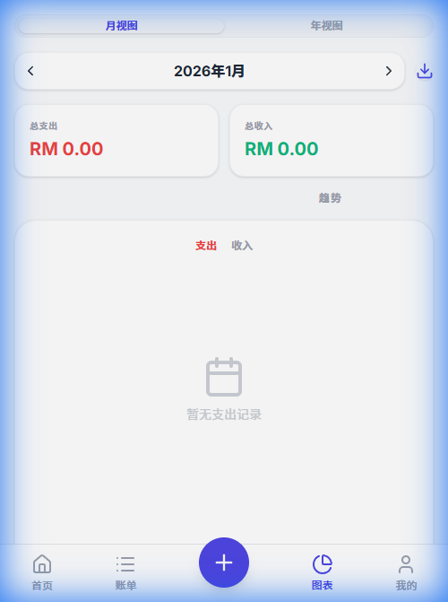

# 简记账 (Jijizhang)

一个简洁、优雅且高效的个人记账 PWA 应用。

## 功能预览

| 首页概览 | 记账界面 |
| :---: | :---: |
|  |  |

| 统计分析 | 个人设置 |
| :---: | :---: |
|  |  |

## 特性

- **隐私至上**：所有数据均存储在浏览器本地 (IndexedDB)，不上传服务器。
- **PWA 支持**：可作为应用安装在手机桌面上，离线可用。
- **现代化设计**：基于 React 19 + Tailwind CSS 构建，拥有流畅的动画和精美的 UI。
- **图表分析**：直观展示每月收支趋势和比例。
- **应用锁**：支持设置 PIN 码保护隐私。
- **多账户管理**：轻松管理现金、银行卡、电子钱包等。
- **预算系统**：设定消费限额，防止超支。

## 部署到 Vercel

本项目已配置好 Vercel 部署。您可以直接连接您的 GitHub 仓库：

1. 将代码推送到 GitHub。
2. 在 Vercel 后台点击 **Add New Project**。
3. 导入您的仓库。
4. Vercel 会自动识别 Vite 项目并进行部署。
   - **Framework Preset**: `Vite`
   - **Build Command**: `npm run build`
   - **Output Directory**: `dist`

## 本地开发

```bash
# 安装依赖
npm install

# 启动开发服务器
npm run dev

# 构建生产版本
npm run build
```

## 技术栈

- **框架**: [React 19](https://react.dev/)
- **构建工具**: [Vite 7](https://vite.dev/)
- **数据库**: [Dexie.js](https://dexie.org/) (IndexedDB wrapper)
- **样式**: [Tailwind CSS 4](https://tailwindcss.com/)
- **图标**: [Lucide React](https://lucide.dev/)
- **组件库**: 原生 UI 组件
- **状态管理**: React Hooks
- **PWA**: [Vite Plugin PWA](https://vite-pwa-org.netlify.app/)
